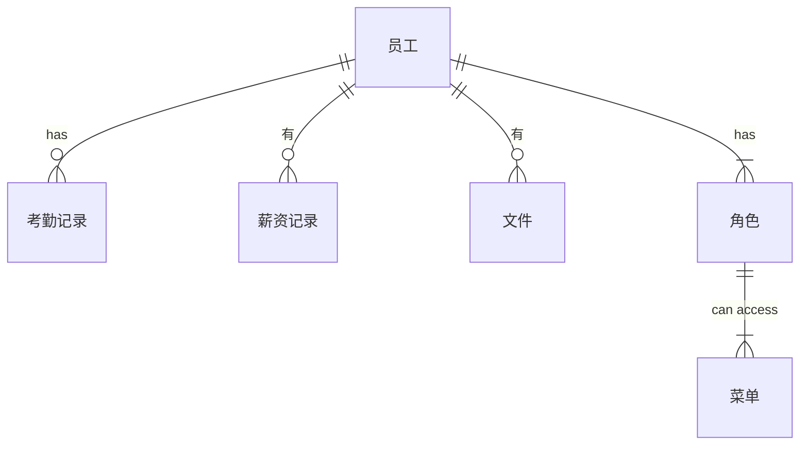

```mermaid
erDiagram
              "员工" ||--o{ "考勤记录" : "has"
    "员工" ||--o{ "薪资记录" : "有"
    "员工"||--o{ "文件" : "有"
    "员工" ||--|{ "角色" : "has"
    "角色" ||--|{ "菜单" : "can access" 
            
```