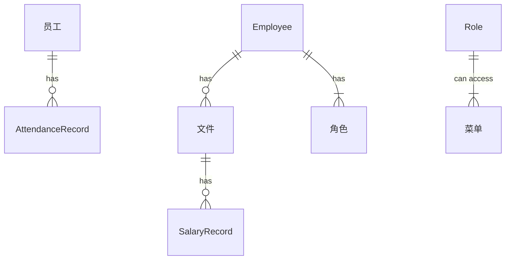

```mermaid
erDiagram
              "员工" ||--o{ AttendanceRecord : "has"
    "文件" ||--o{ SalaryRecord : "has"
    Employee ||--o{ "文件" : "has"
    Employee ||--|{ "角色" : "has"
    Role ||--|{ "菜单" : "can access" 
            
```