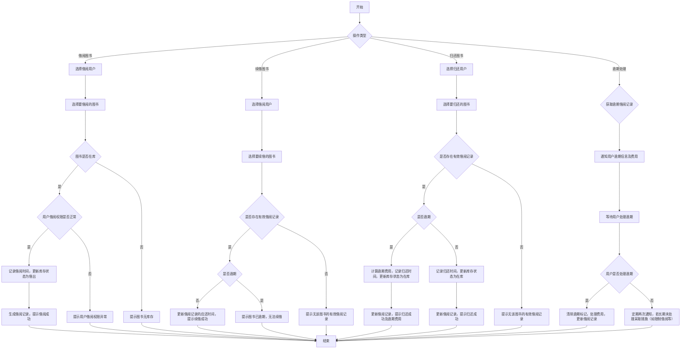

```mermaid
flowchart TD
    A[开始] --> B{操作类型}
    B -->|借阅图书| C[选择借阅用户]
    C --> D[选择要借阅的图书]
    D --> E{图书是否在库}
    E -->|是| F{用户借阅权限是否正常}
    F -->|是| G[记录借阅时间，更新库存状态为借出]
    G --> H[生成借阅记录，提示借阅成功]
    H --> I[结束]
    F -->|否| J[提示用户借阅权限异常]
    J --> I
    E -->|否| K[提示图书无库存]
    K --> I
    B -->|续借图书| L[选择借阅用户]
    L --> M[选择要续借的图书]
    M --> N{是否存在有效借阅记录}
    N -->|是| O{是否逾期}
    O -->|否| P[更新借阅记录的应还时间，提示续借成功]
    P --> I
    O -->|是| Q[提示图书已逾期，无法续借]
    Q --> I
    N -->|否| R[提示无该图书的有效借阅记录]
    R --> I
    B -->|归还图书| S[选择归还用户]
    S --> T[选择要归还的图书]
    T --> U{是否存在有效借阅记录}
    U -->|是| V{是否逾期}
    V -->|是| W[计算逾期费用，记录归还时间，更新库存状态为在库]
    W --> X[更新借阅记录，提示归还成功及逾期费用]
    X --> I
    V -->|否| Y[记录归还时间，更新库存状态为在库]
    Y --> Z[更新借阅记录，提示归还成功]
    Z --> I
    U -->|否| AA[提示无该图书的有效借阅记录]
    AA --> I
    B -->|逾期处理| AB{获取逾期借阅记录}
    AB --> AC[通知用户逾期信息及费用]
    AC --> AD[等待用户处理逾期]
    AD --> AE{用户是否处理逾期}
    AE -->|是| AF[清除逾期标记，处理费用，更新借阅记录]
    AF --> I
    AE -->|否| AG[定期再次通知，若长期未处理采取措施（如限制借阅等）]
    AG --> I
```