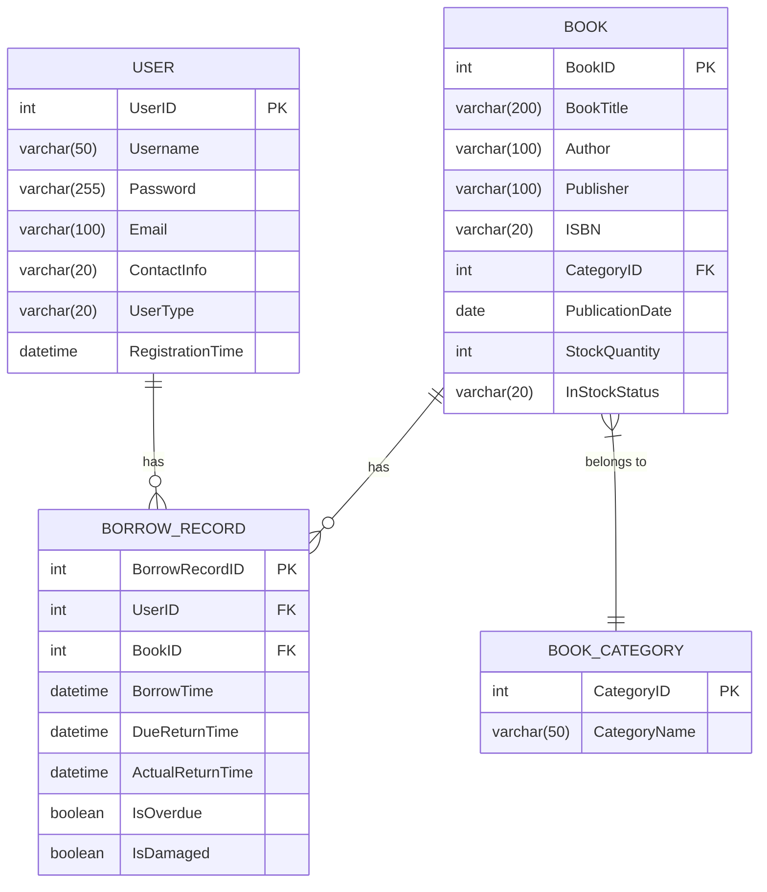

```mermaid
erDiagram
    USER {
        int UserID PK
        varchar(50) Username
        varchar(255) Password
        varchar(100) Email
        varchar(20) ContactInfo
        varchar(20) UserType
        datetime RegistrationTime
    }
    BOOK {
        int BookID PK
        varchar(200) BookTitle
        varchar(100) Author
        varchar(100) Publisher
        varchar(20) ISBN
        int CategoryID FK
        date PublicationDate
        int StockQuantity
        varchar(20) InStockStatus
    }
    BOOK_CATEGORY {
        int CategoryID PK
        varchar(50) CategoryName
    }
    BORROW_RECORD {
        int BorrowRecordID PK
        int UserID FK
        int BookID FK
        datetime BorrowTime
        datetime DueReturnTime
        datetime ActualReturnTime
        boolean IsOverdue
        boolean IsDamaged
    }
    USER ||--o{ BORROW_RECORD : "has"
    BOOK ||--o{ BORROW_RECORD : "has"
    BOOK }|--|| BOOK_CATEGORY : "belongs to"    
```