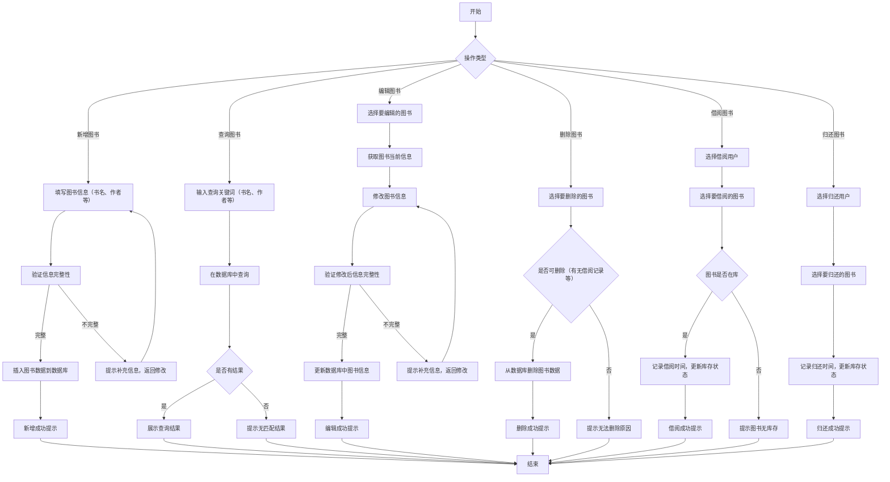

```mermaid
flowchart TD
    A[开始] --> B{操作类型}
    B -->|新增图书| C[填写图书信息（书名、作者等）]
    C --> D[验证信息完整性]
    D -->|完整| E[插入图书数据到数据库]
    D -->|不完整| F[提示补充信息，返回修改]
    F --> C
    E --> G[新增成功提示]
    G --> H[结束]
    B -->|查询图书| I[输入查询关键词（书名、作者等）]
    I --> J[在数据库中查询]
    J --> K{是否有结果}
    K -->|是| L[展示查询结果]
    L --> H
    K -->|否| M[提示无匹配结果]
    M --> H
    B -->|编辑图书| N[选择要编辑的图书]
    N --> O[获取图书当前信息]
    O --> P[修改图书信息]
    P --> Q[验证修改后信息完整性]
    Q -->|完整| R[更新数据库中图书信息]
    Q -->|不完整| S[提示补充信息，返回修改]
    S --> P
    R --> T[编辑成功提示]
    T --> H
    B -->|删除图书| U[选择要删除的图书]
    U --> V{是否可删除（有无借阅记录等）}
    V -->|是| W[从数据库删除图书数据]
    W --> X[删除成功提示]
    X --> H
    V -->|否| Y[提示无法删除原因]
    Y --> H
    B -->|借阅图书| Z[选择借阅用户]
    Z --> AA[选择要借阅的图书]
    AA --> AB{图书是否在库}
    AB -->|是| AC[记录借阅时间，更新库存状态]
    AC --> AD[借阅成功提示]
    AD --> H
    AB -->|否| AE[提示图书无库存]
    AE --> H
    B -->|归还图书| AF[选择归还用户]
    AF --> AG[选择要归还的图书]
    AG --> AH[记录归还时间，更新库存状态]
    AH --> AI[归还成功提示]
    AI --> H
```